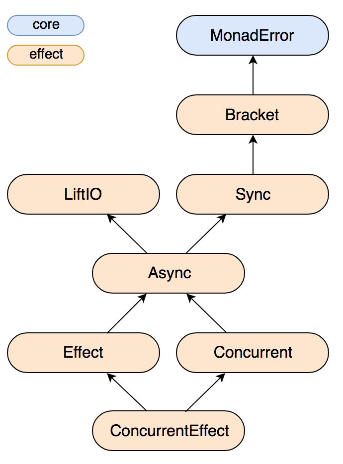

# prelude utils

---

## Motivation

`Functional programming + static typing = Haskell`

`... Functional programming + static typing ... = Scala`

`Scala --> Haskell`

#### Primer

- Referential Transparency |
- Composition over Imperativity |

#### Meat

- Effect Abstraction |

<!--  hello -->

---

### Referential Transparity

_An expression can be replaced by its value (or anything with the same value) without changing
the results of the program_

```scala
val x = println("non RT")
f(x, x)

def x = println("RT")
f(x, x)

val x = Future(println("non-RT"))
```

@[4-5](But `println` is still non RT  where the equivalent in Haskell, `putStrLn`, is due to lazyness)
@[7](The fundamental concurrency primitive is non RT)

#### Benefits:

- Reasonability |
- Testability |
- Express programs as in memory expression trees |

[//]: # (hello)

---

### Composition over Imperitivity

Code like this evince bad memories?

```scala
def pleaseFixMe(something: Int) = {
  val a = performSomeSideEffectReturningA
  val b = decodeABFromANotCatchingExceptions(a)
  b.setFoo(new Foo(something)) // oh god
  b
}
```

[//]: # (You're assigning arbitrary expressions, which may or may not occur in a context, monadic or not, to vals, which then may or may not be used but may depend on a previous imperative declaration, and you're mutating a val)

---

Haskell forbids such an imperative style but can be mimiced with:

```haskell
test :: Int
test = let x = 2
           y = x + 2
       in x + y + z + a
       where z = 2
             a = z + 2

readIn :: IO ()
readIn = do
  line <- getLine
  let res = "you said: " ++ line
  putStrLn res

```
@[2-4](let clause)
@[5-6](where clause)
@[8-12](monadic composition)

---

```scala
for {
  x <- Some(5)
  y <- Some(x + 3)
} yield y
```

@[1-4](That last Haskell example should look familiar to)

#### Benefits

* Reasonability |
* Testability |
* Monadic context |

[//]: # (Testability -- via composability since you can test individual functions or chained functions)

[//]: # (Anyway the benefit to modeling imperativity like this is that you have think of and compose things inside of an appropriate monadic context (for effects that would be `IO`, for things that may throw exceptions `Either`, for values that may or may not be there `Option` (or `Maybe`)

---

### So how can we apply composition and RT to side-effect?

---

### IO

The trouble with Scala

```scala
val res: Array[Byte] = httpClient.get("https://en.wikipedia.org/wiki/Side_effect_(computer_science)")
```

@[1](This is perfectly legal)

Where Haskell requires you perform all effects in `IO` So we need an `IO` monad for Scala that
has referential transparity as a property unlike `Future` for example

#### Enter `cats-effect`

---



---

### Effect Abstraction

We've all seen code like this which is perfectly legal regretably:

```scala
// perform IO willy nilly
val res = mongoColl.find(query)
```

What is better is:

```scala
Either.catchNonFatal(mongoColl.find(query))
```

But this is cheating/not giving you the full picture:

```scala
trait Sync[F[_]] {
  def sync[A](f: F[A]): F[A]
}

def find[F: Sync](q: DBOBject) = sync[F](mongoUserColl.find(q))

```

All effects must be performed inside of an effect typeclass API (in Haskell the defacto instance of this typeclass (called `MonadIO` is the `IO` monad. Now Scala has `IO` and effectful typeclasses too. This forces the developer to handle/reason about effects appropriately

---

### 2. Referential transparency

```scala
val ref: F[Either[Throwable, WriteResult]] = find(someQuery).attempt

// we don't lose RT until we actually perform the effect at the end of the world
ref.unsafePerformIO: Either[Throwable, WriteResult]

// for clarity, basically the same as:
Either.catchNonFatal(find(someQuery).unsafePerformIO): Either[Throwable, WriteResult]

```

Lets do something a bit more involved:

```scala

// say we have a unique index and we want to catch `com.mongodb.DuplicateKeyException` exceptions
sync[F](mongo.insert(caseClassInst.toDBObject))
  .handleErrorWith {
    case dupErr: com.mongodb.DuplicateKeyException =>
      ApplicativeError[F, Throwable].raiseError[WriteResult](
        new UpsException(
          UpstreamFailure(DuplicateRecord(caseClassInst))
        )
      )
    case ex =>
      ApplicativeError[F, Throwable].raiseError[WriteResult](
        new UpsException(
          UpstreamFailure(WriteFailure(ex.getMessage))
        )
      )
  }

```

So you see how we can very neatly compose an expression tree, an in memory representation of our program
that can be executed when we so choose, via `unsafePerformIO()` or async via `unsafePerformAsync(cb)` making it easier to reason about what we're writing and increasing
testability

---

### 3. No imperative muddling


This is Java, not Scala, or at least not functional Scala

In Haskell the only way to simulate imperative programming is via monadic composition

```haskell
main :: IO ()
main = do
  line <- getLine
  let res = "you said: " ++ line
  putStrLn res
```

Obviously the equivalent in Scala would be akin to:

```scala
for {
  x <- Some(5)
  y <- Some(x + 3)
} yield y
```

 which generally leads to, again, increased composability and
more explicit semantics behind whatever computation you are performing

---

### Utils

Piggy backing off of effect abstraction:
* _Effect typeclasses_

Which will serve as the foundation for:
* _HTTP wrapper_
* _Cache wrapper_

And then some unrelated useful components:
* _Error hierarchy_
* _Json_
* _Geo_

---

### HTTP

Here's what the interface looks like:

```scala
trait EfJsonHttpClient[F[_]] extends {

  // `JsonDecodable` just points to typeclass `io.circe.Decoder[A]`
  def get[A: JsonDecodable](url: Url): F[HttpResponse[Either[JsonErr, A]]]

  // same with `JsonEncodable`
  def post[A: JsonEncodable](
    url: Url,
    body: A,
    headers: Map[String, String] = Map.empty
  ): F[HttpResponse[Unit]]
}


```

This is a simple wrapper around the `com.softwaremill.sttp` library, which already employs a similar effect abstraction pattern
and allows you to wrap whatever underlying client you so choose


---

### And our impl

```scala
final class JsonHttpClient[F[_]: Effect](
  conf: HttpConfig
  )(implicit ev: SttpBackend[F, Nothing])
  extends EfJsonHttpClient[F]{

  private val baseC = sttp.readTimeout(conf.connectionTimeout)

  def respAsJson[B](implicit ev: JsonDecodable[B]): ResponseAs[Either[JsonErr, B], Nothing] = {
    asString.map{s =>
      for {
        json <- Json.parse(s).leftMap(_.asInstanceOf[JsonErr])
        b <- ev.decodeJson(json.repr).leftMap(err => (new JsonDecodeErr(err.getMessage())): JsonErr)
      } yield b
    }
  }

  override def get[A: JsonDecodable](url: Url): F[HttpResponse[Either[JsonErr, A]]] = {
    baseC
      .get(SUrl(
        url.scheme.asString,
        None,
        url.host.repr,
        None,
        url.path.toList,
        List.empty[SUrl.QueryFragment],
        None
      ))
      .response(respAsJson[A])
      .send[F]()
      .map(new HttpResponse(_))
  }

  override def post[A: JsonEncodable](
    url: Url,
    body: A,
    headers: Map[String, String]
  ): F[HttpResponse[Unit]] = {
    baseC
      .post(Url(
        url.scheme.asString,
        None,
        url.host.repr,
        url.port,
        url.path.toList,
        List.empty[Url.QueryFragment],
        None
      ))
      .body(body.toJson.spaces2, StandardCharsets.UTF_8.name)
      .send[F]()
      .map(new HttpResponse(_).mapBody(_ => ()))
  }
}
```

